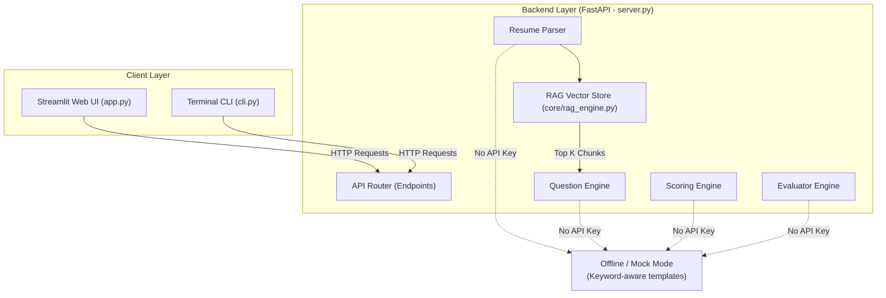
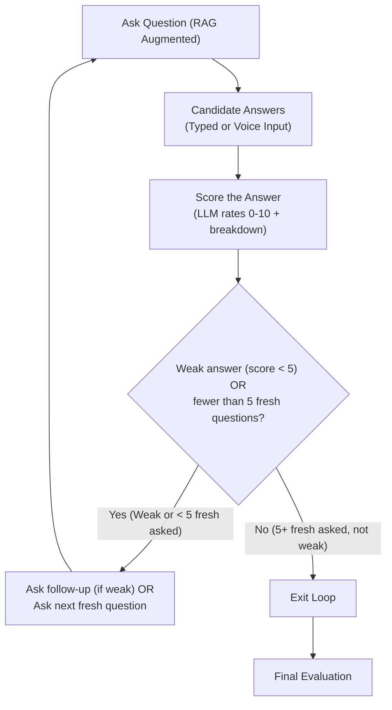

# HireAI: Intelligent Structured Interview Agent

An autonomous AI Interview Agent that conducts structured mock technical interviews end-to-end. It features **Retrieval-Augmented Generation (RAG)** for vector-based resume chunking and context retrieval. It runs entirely locally or on free tiers using **FastAPI**, and is designed to work **completely without API keys** in a robust, offline mock mode. When API keys are provided for **Groq** or **Google Gemini**, the FastAPI server acts as a gateway to these models for dynamic technical evaluations.

The app supports voice synthesis (Text-to-Speech) for the interviewer and browser-native voice transcription (Speech-to-Text) for the candidate.

---

## 📌 Project Overview
- **Project Name:** HireAI Interview Agent
- **Live Demo URL:** [https://interview-agent-1-dejj.onrender.com/](https://interview-agent-1-dejj.onrender.com/)
- **One-Sentence Core:** HireAI takes a candidate's resume/profile along with interactive answers and produces an objective, question-by-question technical evaluation report powered by RAG and adaptive LLM prompts.

## 🚀 Expected Capabilities Implemented
* **RAG Vector Store & Context Retrieval:** Chunks uploaded resumes into semantic blocks and performs vector similarity search (TF-IDF + Cosine Similarity) to retrieve the top-$K$ most relevant resume context blocks for each question turn.
* **Dynamic Role-Specific Question Generation:** Generates contextual questions from candidate profiles without repeating historical nodes.
* **Turn-by-Turn Response Scoring:** Provides a granular score out of 10 for each response based on relevance, clarity, depth, and evidence.
* **Comprehensive Session Evaluation:** Outputs a clean Markdown and structured JSON session summary of candidate highlights and growth areas.
* **Multi-Turn State Engine:** Successfully supports a full multi-turn evaluation stream (up to 5+ questions).

---

## 🛠️ Tech Stack & Architecture
- **Backend Framework:** FastAPI (Python 3.10+)
- **Frontend Dashboard UI:** Streamlit (with custom dark-themed glassmorphism elements)
- **Client Fallback:** Command Line Interface (CLI)
- **RAG Vector Engine:** Semantic chunking + Cosine Similarity Vector Index (`core/rag_engine.py`)
- **AI Orchestration:** System-prompt engineered LLM pipeline with memory tracking
- **Storage Layer:** Local filesystem storage (`data/sessions/` directory utilizing timestamps)

### System Architecture
The application is structured as a client-server architecture:
- **Backend:** A local FastAPI REST API server (`server.py`) that handles all core logic (resume parsing, RAG vector indexing, question generation, scoring, and evaluations).
- **Clients:** A Streamlit web dashboard (`app.py`) and a terminal CLI fallback (`cli.py`). Both interfaces communicate with the backend via HTTP REST endpoints.



### Detailed Interview Loop Logic


---

## 📦 Installation & Setup Instructions
```bash
# 1. Clone the repository
git clone https://github.com/Nandunandu24/Interview-Agent.git
cd Interview-Agent

# 2. Create and activate a virtual environment
python -m venv venv
# On Windows use:
venv\Scripts\activate
# On macOS/Linux use:
source venv/bin/activate

# 3. Install pinned dependencies
pip install -r requirements.txt
```

### Environment Configuration
To use actual LLMs (online mode), copy the `.env.example` file to `.env`:
```bash
cp .env.example .env
```
Open the `.env` file and configure your API keys (e.g. Groq or Google Gemini):
```ini
# Groq API Key (Llama-3.3-70b-versatile / Llama-3.1-8b-instant)
GROQ_API_KEY="your_groq_api_key_here"

# Gemini API Key (Gemini 2.0 Flash / Gemini 1.5 Flash)
GEMINI_API_KEY="your_gemini_api_key_here"
```
*Note: If no API keys are configured, the server automatically boots in **Offline Mock Mode**, allowing you to test and run the entire interview simulation offline.*

---

## 🏃 How to Run the Agent End-to-End
To run the agent, you need to start the FastAPI backend server first and then launch one of the client interfaces.

### Step 1: Start the Backend (FastAPI Server)
Run the following command in your terminal to boot the server:
```bash
python server.py
```
The backend server will start locally at `http://127.0.0.1:8000`.

### Step 2: Run the Client Interface
Open a second terminal window, activate your virtual environment, and run either the Web UI or the CLI:

#### Option A: Launch the Web UI Dashboard (Streamlit - Recommended)
```bash
streamlit run app.py
```
This launches a browser-based dashboard. Upload your resume, click **🚀 Start Interview**, and conduct your interactive technical interview.

#### Option B: Launch the Terminal UI (CLI Fallback)
```bash
python cli.py
```
This runs a fully guided, keyboard-interactive technical mock interview directly in your console.

### Running Automated Integration Tests
To verify all FastAPI endpoints, RAG vector search, offline mock fallbacks, and parsing components:
```bash
python -m unittest test_agent.py
```

---

## 📄 Sample Inputs and Outputs (The Deliverables)
Every mock interview session conducts an interactive dialogue (at least 5 questions) and auto-saves the raw session transcript and candidate evaluation summaries.

### In-Repo Deliverable Locations
- **Saved Session Transcripts:** Transcripts are automatically saved locally inside the `data/sessions/` directory utilizing timestamps.
- **Reference Deliverables:**
  - **Structured JSON Transcript:** [sample_transcript.json](data/sessions/sample_transcript.json) - Contains the complete raw transcript payload, including turn-by-turn scores (0-10) and relevance/correctness/clarity criteria breakdowns.
  - **Comprehensive Markdown Assessment Report:** [sample_transcript.md](data/sessions/sample_transcript.md) - Contains the complete formatted Candidate Assessment Report, including:
    1. Executive Summary (Overall Verdict, Key Strengths, Growth Areas)
    2. Dimension Breakdown & Scoring (Communication, Technical Depth, Problem Solving)
    3. Detailed Technical Assessment (Logic, Optimization, Edge cases)
    4. Tailored Actionable Suggestions (For Candidate, For Hiring Team)

---

## ⚖️ Tradeoff Notes & Technical Reasoning

### 1. RAG Vector Store Design
- **Lightweight & Deployment-Safe RAG:** Rather than utilizing heavy C++/GPU vector databases (like ChromaDB or FAISS) which risk out-of-memory crashes on free cloud tiers (Render/Railway), we implemented an in-memory TF-IDF and Cosine Similarity vector store (`core/rag_engine.py`). This guarantees sub-millisecond similarity retrieval, cross-platform portability, and zero deployment overhead.

### 2. Model & API Selections
- **Groq & Google Gemini APIs:** Groq was selected as the primary online inference engine due to its sub-second token latency, allowing for fluid real-time speech-to-text response feedback loops. Google Gemini was included as an alternative provider because of its large context window and strong performance on structural coding tasks.

### 3. Local Filesystem vs. Database Storage
- **Decision:** Session logs are persisted locally as JSON and Markdown files (`data/sessions/`) rather than using an external relational database (like PostgreSQL) or cloud database (like MongoDB).
- **Reasoning:** Local files eliminate the overhead of database provisioning, connection pools, and migration scripts. Plain files are highly portable, require zero configuration to run, and allow direct inspectability for reviewers.

### 4. Client-Side Speech APIs
- **Decision:** Built-in web Text-to-Speech (TTS) and Speech-to-Text (STT) APIs were implemented.
- **Reasoning:** Running audio client-side reduces server latency, eliminates expensive server-side audio transcription API costs, and runs out-of-the-box in Chrome without extra Python audio dependencies.

